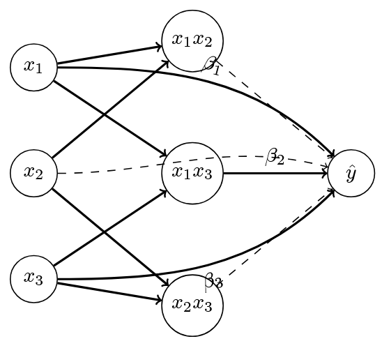

# Model Building

## Model Architecture

Our approach to predicting Learning Commons usage patterns employed a systematic evaluation of multiple modeling strategies. We implemented a range of statistical learning methods, with particular emphasis on **_Penalized Splines_** due to their flexibility in capturing non-linear relationships while maintaining interpretability.

## Feature Processing Framework

Our framework combines three key components:

1. Base algorithms with hyperparameter ranges
2. Feature processing pipelines
3. Cross-validation strategies

This modular design allows systematic evaluation of each combination while 
maintaining consistent validation metrics (RMSE, R²) across all configurations. 
The framework handles task-specific requirements through:

- Duration predictions: Log-normal transformations and continuous outputs
- Occupancy predictions: Integer constraints and count-based distributions

### Base Algorithms

#### Shared Model Types

| Model Type | Key Characteristics | Hyperparameter Range |
|------------|-------------------|---------------------|
| Ridge | Linear with L2 penalty | $\alpha \in [10^0, 10^2]$ |
| Lasso | Linear with L1 penalty | $\alpha \in [10^{-2}, 10^0]$ |
| Penalized-Splines | Cubic splines with ridge penalty | knots: {9, 11, 13, 15}, <br> ridge: $\alpha \in [10^0, 10^2]$ |
| KNN | Non-parametric | neighbors: {15, 17, 19, 21}, <br> weights: {uniform, distance} |

The **_Penalized-Splines_** implementation incorporated additional parameters, including a fixed cubic degree (3) and ridge regularization to prevent overfitting. For **_KNN_** models, we evaluated both uniform and distance-based weighting schemes.

#### Task-Specific Model Types

Our framework addresses two distinct prediction tasks which had two distinct distributions that suggested different modeling strategies in terms of Generalized Linear Models:

##### Duration Prediction
- Log-normal transformation for right-skewed distribution
- Feature selection: k ∈ [10, 50]
- Evaluation on original scale (minutes)
- Best performance with kfold validation

##### Occupancy Prediction

- Distribution modeling: Poisson and Weibull
- Integer constraints via RoundedRegressor
- Feature selection: k ∈ [70, 100]
- Superior results with rolling validation

### Feature Processing Pipelines

We developed three distinct pipeline configurations to systematically evaluate 
feature engineering strategies:

1. **_vanilla_**: A minimalist approach using scaled features directly

   ```
   Scaling → Model
   ```

   This pipeline preserves our engineered feature set (~200 predictors) without additional transformations, providing a robust baseline while maintaining interpretability.

2. **_interact_select_**: Interaction Network

   ```
   Scaling → Interactions → SelectKBest → Model
   ```

   
   
   This pipeline implements a sparse, shallow mesh network architecture where each node in the interaction layer combines exactly two nodes from the input layer. Given our approximately 200 engineered features, creating all possible two-way interactions would result in an intractable number of combinations. To manage this dimensionality, we employ **_SelectKBest_** with **_f_regression_** to identify the most influential raw and interaction terms selecting 70 to 100 of them.

   Key characteristics:
   
   - Input features combine through binary interactions
   - Feature selection preserves strongest connections
   - Functions as simplified neural network without activation functions

   This approach can be viewed as a simplified neural network where we restrict ourselves to binary interactions and linear combinations, avoiding the complexity of activation functions while still capturing feature relationships through the mesh structure.

3. **_pca_lda_**: Hybrid Dimensionality Reduction

   ```
   Scaling → PCA/LDA → Interactions → SelectKBest → Model
   ```

   This pipeline combines two complementary dimensionality reduction techniques before interaction modeling. We extract principal components that explain 95% of the variance (**_PCA_**) alongside 10 linear discriminant components (**_LDA_**), aiming to capture both the dominant patterns in feature variation and natural class separations in the data. These reduced-dimension components are then allowed to interact, with **_SelectKBest_** filtering the most predictive combinations.

   Key characteristics:
   - **_PCA_** components capture maximum variance directions
   - **_LDA_** components identify discriminative patterns
   - Interactions between **_PCA_** and **_LDA_** components explore synergies
   - Allows interactions between reduced components
   - Uses SelectKBest for final feature selection

   This hybrid approach attempts to leverage both the variance-explaining power of **_PCA_** and the class-separating ability of **_LDA_** before allowing their components to interact.

Each pipeline employs one of three scaling methods:

- **_StandardScaler_**: $(x - \mu)/\sigma$
- **_RobustScaler_**: $(x - Q_2)/(Q_3 - Q_1)$
- **_MinMaxScaler_**: $(x - x_{min})/(x_{max} - x_{min})$

### Cross-Validation Strategies

We evaluated three temporal validation approaches to assess model performance:

| Strategy | Description | Characteristics | Best For |
|----------|-------------|-----------------|----------|
| **_kfold_** | Random k splits | - Provides baseline performance<br>- Less suitable for temporal patterns | Duration prediction |
| **_rolling_** | Fixed-size moving window | - Captures recent temporal dependencies<br>- Maintains consistent training size | Occupancy prediction |
| **_expanding_** | Growing window | - Accumulates historical data<br>- Increases training size over time<br>- Balances temporal and volume effects | Long-term trends |

## Training Implementation

Our training framework implements a systematic approach to model evaluation, utilizing MLflow for experiment tracking and reproducibility. The implementation handles both duration and occupancy predictions through parallel but specialized pipelines.

### Core Training Architecture

The training framework consists of three main components:

1. **Data Preparation Pipeline**
```python
def load_and_prepare_data(project_root: str):
    """Load and prepare the dataset."""
    df = pd.read_csv(f'{project_root}/data/processed/train_engineered.csv')
    
    # Identify targets and features to exclude
    target = 'Duration_In_Min'  # or 'Occupancy'
    features_to_drop = ['Student_IDs', 'Semester', ..., target]
    
    X, y = prepare_data(df, target, features_to_drop)
    return train_test_split(X, y, test_size=0.2, shuffle=False)
```

2. **Model Training Orchestration**
```python
def train_models(X_train, y_train, X_test, y_test):
    """Main training function."""
    models = get_model_definitions()
    pipelines = get_pipeline_definitions()
    cv_methods = get_cv_methods(len(X_train))
    scalers = [RobustScaler(), StandardScaler(), MinMaxScaler()]
```

3. **Evaluation Framework**
```python
def evaluate_final_models(results, X_test, y_test):
    """Model evaluation with consistent metrics."""
    metrics = {
        'RMSE': np.sqrt(mean_squared_error(y_test, y_pred)),
        'R2': r2_score(y_test, y_pred)
    }
```

### Training Process Details

Our implementation employs a grid search approach with cross-validation for hyperparameter optimization. The process includes several key components:

1. **Experiment Management**
   - MLflow tracking server integration
   - Systematic experiment naming conventions
   - Automated metric logging and model versioning

2. **Resource Management**
   - Parallel processing with joblib
   - Garbage collection after each model iteration
   - Error handling with graceful degradation

3. **Model Persistence**
   - Consistent model naming scheme
   - Automated model registration
   - Version control for model artifacts

### Task-Specific Implementations

The framework accommodates distinct requirements for each prediction task:

#### Duration Prediction
```python
# Custom scoring metric for duration
rmse_scorer = make_scorer(
    lambda y_true, y_pred: np.sqrt(mean_squared_error(y_true, y_pred)),
    greater_is_better=False
)

# Grid search configuration
search = GridSearchCV(
    pipeline, 
    params,
    scoring=rmse_scorer,
    cv=cv,
    n_jobs=-1,
    verbose=0,
    error_score='raise'
)
```

Key characteristics:
- Direct RMSE optimization
- Non-negative prediction constraints
- Log-transformation handling

#### Occupancy Prediction
```python
# Model registration with task-specific naming
model_name = f"{name}_{scale_type}_{cv_name}"
mlflow.sklearn.log_model(
    search.best_estimator_,
    "model",
    registered_model_name=model_name
)
```

Key characteristics:
- Integer prediction enforcement
- Count-based distribution handling
- Temporal validation integration

### Implementation Considerations

Several technical considerations shaped our implementation:

1. **Reproducibility**
   - Fixed random seeds for splits
   - Consistent evaluation metrics
   - Versioned dependencies and environments

2. **Scalability**
   - Parallel processing capabilities
   - Memory-efficient data handling
   - Modular pipeline design

3. **Monitoring**
   - Comprehensive logging system
   - Performance metric tracking
   - Model lineage documentation

This implementation strategy ensures reproducible results while maintaining flexibility for future extensions and modifications. The separation of concerns between data preparation, model training, and evaluation facilitates maintenance and enables independent optimization of each component.

## Model Testing Framework

Our testing implementation employs a comprehensive evaluation strategy, utilizing both quantitative metrics and visual analysis tools. The framework is designed to assess model performance across multiple dimensions while ensuring reproducibility and thorough documentation.

### Testing Architecture

The testing framework consists of three primary components:

1. **Data Management and Evaluation**
```python
# Time series train-test split
X_train, X_test, y_train, y_test = train_test_split(
    X, y,
    test_size=0.2,
    shuffle=False  # Maintains chronological order
)

# Metrics calculation
metrics = calculate_metrics(y_test, y_pred)
```

2. **Model Loading and Prediction**
```python
def evaluate_models(experiment_base):
    """Systematic model evaluation process."""
    experiments = client.search_experiments(
        filter_string=f"name LIKE '{experiment_base}/%'"
    )
    
    for pipeline_type in ['vanilla', 'interact_select', 'pca_lda']:
        for cv_name in ['kfold', 'rolling', 'expanding']:
            model = mlflow.sklearn.load_model(
                f"models:/{model_name}_{pipeline_type}_{cv_name}/latest"
            )
```

3. **Visualization and Analysis**
```python
# Performance visualization
plot_prediction_analysis(y_test, y_pred, full_model_name)
plot_feature_importance_biplot(
    X_test, y_test, y_pred, 
    X_test.columns,
    results_path
)
```

### Evaluation Strategy

Our testing framework implements a multi-faceted evaluation approach:

1. **Performance Metrics**
   - Root Mean Square Error (RMSE)
   - R² Score
   - Distribution alignment analysis
   - Prediction bias assessment

2. **Visual Analysis**
   - Prediction vs. Actual plots
   - Feature importance biplots
   - Error distribution analysis
   - Temporal performance patterns

3. **Model Comparison**
   - Cross-pipeline performance analysis
   - Cross-validation method impact
   - Model stability assessment

### Task-Specific Testing Considerations

#### Duration Prediction Testing
```python
# Duration-specific visualization
fig = plot_prediction_analysis(y_test, y_pred, full_model_name)
plt.savefig(f'{project_root}/results/duration/prediction_analysis_{full_model_name}.png')

# Best model tracking
if metrics['RMSE'] < best_model_rmse:
    best_model_rmse = metrics['RMSE']
    best_model_predictions = y_pred
```

Key testing aspects:
- Log-scale error analysis
- Duration-specific outlier detection
- Temporal consistency evaluation

#### Occupancy Prediction Testing
```python
# Occupancy-specific metrics
metrics = calculate_metrics(y_test, y_pred.round())  # Integer predictions
save_visualization_results(results_df, project_root)
```

Key testing aspects:
- Integer prediction validation
- Occupancy range constraints
- Peak period accuracy assessment

### Testing Implementation Details

Several technical considerations guided our testing implementation:

1. **Error Handling and Logging**
```python
try:
    model = mlflow.sklearn.load_model(f"models:/{full_model_name}/latest")
    print(f"    Successfully loaded model")
except Exception as e:
    print(f"    Couldn't load model: {e}")
    continue
```

2. **Results Management**
```python
# Results organization
results_df = pd.DataFrame(test_results)
results_df.sort_values('RMSE', inplace=True)

# Top performers selection
top_3_results = sorted(
    experiment_results, 
    key=lambda x: x['RMSE']
)[:3]
```

3. **Visualization Pipeline**
- Automated plot generation
- Consistent formatting
- Multi-level performance analysis
- Interactive visualization options

### Testing Framework Benefits

Our testing implementation provides several key advantages:

1. **Reproducibility**
   - Consistent evaluation metrics
   - Standardized testing procedures
   - Version-controlled test sets

2. **Comprehensive Analysis**
   - Multiple performance dimensions
   - Visual and numerical metrics
   - Cross-model comparisons

3. **Practical Insights**
   - Model behavior understanding
   - Feature importance analysis
   - Deployment readiness assessment

This testing framework ensures thorough evaluation of model performance while maintaining clarity and reproducibility in the assessment process. The combination of quantitative metrics and visual analysis tools provides a comprehensive understanding of model behavior and limitations.

## Model Evaluation Framework

Our evaluation framework consists of two complementary analysis pipelines designed to provide both detailed model performance metrics and parameter optimization insights.

### Performance Analysis Pipeline

The first evaluation component (`model_evals.py`) implements a hierarchical analysis approach:

```python
def load_and_analyze(filepath, dataset_name):
    """Hierarchical model performance analysis."""
    df = pd.read_csv(filepath)
    
    # Analysis by cross-validation strategy
    cv_groups = df.groupby('CV_Method')[['RMSE', 'R2']].agg(['mean', 'std'])
    
    # Analysis by pipeline architecture
    pipeline_groups = df.groupby('Pipeline')[['RMSE', 'R2']].agg(['mean', 'std'])
    
    # Analysis by model type
    model_groups = df.groupby('Model')[['RMSE', 'R2']].agg(['mean', 'std'])
```

This analysis provides:
- Performance metrics grouped by CV strategy
- Pipeline architecture comparisons
- Model type effectiveness assessment
- Statistical significance of differences

### Parameter Optimization Analysis

The second component (`best_model_params.py`) focuses on retrieving and analyzing the optimal model configurations:

```python
def get_best_model_params(eval_path, experiment_base):
    """Extract optimal model parameters from MLflow."""
    # Identify best model combination
    best_row = df.loc[df['RMSE'].idxmin()]
    
    # Retrieve detailed parameters
    model_name = f"{model}_{pipeline}_{cv_method}"
    best_run = client.search_runs(
        experiment_ids=[experiment.experiment_id],
        filter_string=f"attributes.run_name = '{model_name}'"
    )[0]
```

Key capabilities:
- Automated best model identification
- Parameter extraction from MLflow
- Configuration persistence for reproducibility
- Detailed performance metrics retrieval

### Evaluation Results

The evaluation framework produces structured outputs for both prediction tasks:

#### Duration Prediction
```json
{
    "model": "PenalizedSplines",
    "pipeline": "vanilla",
    "cv_method": "kfold",
    "rmse": 59.47,
    "r2": 0.059,
    "parameters": {
        "ridge_alpha": 14.38,
        "n_knots": 15,
        "scaler": "RobustScaler"
    }
}
```

#### Occupancy Prediction
```json
{
    "model": "PenalizedSplines",
    "pipeline": "vanilla",
    "cv_method": "rolling",
    "rmse": 3.64,
    "r2": 0.303,
    "parameters": {
        "ridge_alpha": 29.76,
        "n_knots": 15,
        "scaler": "RobustScaler"
    }
}
```

This evaluation framework enables:
1. Systematic comparison across model architectures
2. Identification of optimal hyperparameters
3. Assessment of feature engineering impact
4. Validation of cross-validation strategy effectiveness