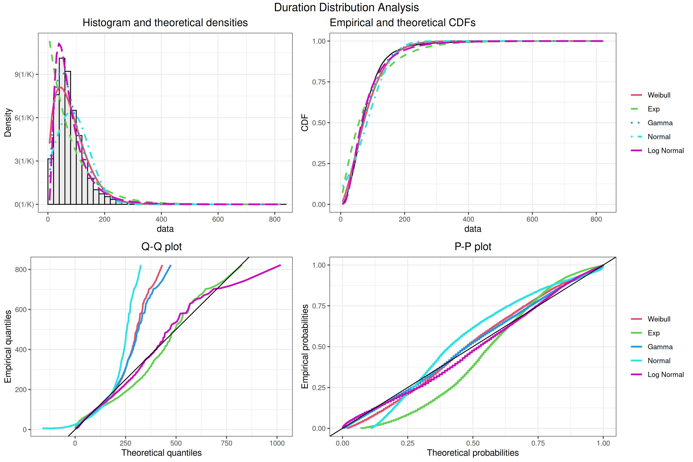
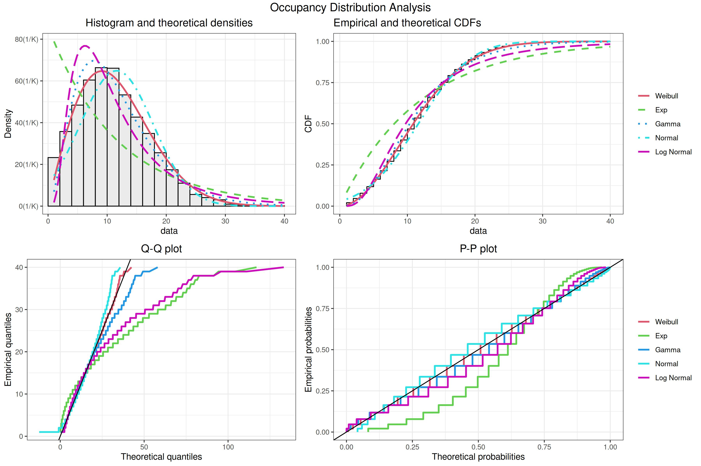
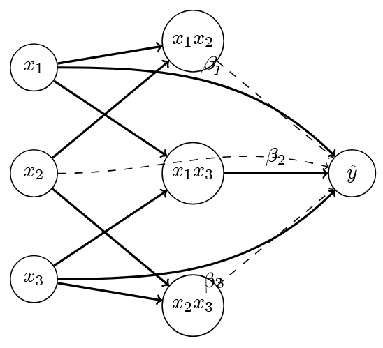

# Models Overview

## Framework Architecture

Our Learning Commons prediction system implements a comprehensive modeling framework designed to address the distinct challenges of duration and occupancy prediction. The architecture emphasizes **_modularity_** and **_systematic evaluation_**, enabling rigorous assessment of multiple modeling strategies while maintaining consistent validation protocols. The implementation can be found in the `src/python/models` directory, specifically in [`algorithms_duration.py`](https://github.com/adabwana/f24-m7550-final-project/blob/master/src/python/models/algorithms_duration.py), [`algorithms_occupancy.py`](https://github.com/adabwana/f24-m7550-final-project/blob/master/src/python/models/algorithms_occupancy.py), [`pipelines.py`](https://github.com/adabwana/f24-m7550-final-project/blob/master/src/python/models/pipelines.py), and [`cross_validation.py`](https://github.com/adabwana/f24-m7550-final-project/blob/master/src/python/models/cross_validation.py).

## Core Components

The framework integrates three primary architectural components that work in concert to enable systematic model evaluation. At its foundation, the **_base algorithms_** provide the core predictive capabilities, each offering distinct approaches to pattern recognition. The **_feature processing pipelines_** implement sophisticated data transformations, while our **_cross-validation strategies_** ensure robust performance assessment.

### Algorithm Architecture

The framework employs both shared and task-specific modeling approaches. Our duration prediction models include:

```python
def get_model_definitions():
    return {
        'Ridge': (Ridge(), {
            'model__alpha': np.logspace(0, 2, 10),
            'select_features__k': np.arange(10, 55, 5),
        }),
        'Lasso': (Lasso(), {
            'model__alpha': np.logspace(-2, 0, 10),
            'select_features__k': np.arange(10, 55, 5),
        }),
        'PenalizedSplines': (Pipeline([
            ('spline', SplineTransformer()),
            ('ridge', Ridge())
        ]), {
            'model__spline__n_knots': [9, 11, 13, 15],
            'model__spline__degree': [3],
            'model__ridge__alpha': np.logspace(0, 2, 20),
            'select_features__k': np.arange(10, 55, 5),
        }),
        'KNN': (KNeighborsRegressor(), {
            'model__n_neighbors': np.arange(15, 22, 2), # Creates [15, 17, 19, 21]
            'model__weights': ['uniform', 'distance'],
            # 'model__metric': ['euclidean', 'manhattan'],
            'select_features__k': np.arange(10, 55, 5),
        }),
    }
```

| Model Type | Key Characteristics | Hyperparameter Range |
|------------|-------------------|---------------------|
| Ridge | Linear with L2 penalty | $\alpha \in [10^0, 10^2]$ |
| Lasso | Linear with L1 penalty | $\alpha \in [10^{-2}, 10^0]$ |
| Penalized-Splines | Cubic splines with ridge penalty | knots: {9, 11, 13, 15}, <br> ridge: $\alpha \in [10^0, 10^2]$ |
| KNN | Non-parametric | neighbors: {15, 17, 19, 21}, <br> weights: {uniform, distance} |

The framework emphasizes **_non-linear pattern capture_** through spline-based modeling while maintaining interpretability. The **_PenalizedSplines_** implementation serves as our primary architecture, employing cubic splines (degree=3) with optimized knot placement and ridge regularization.

### Duration Model Architecture

```python
def get_model_definitions():
    return {
        'PenalizedLogNormal': (Pipeline([
            ('log_transform', FunctionTransformer(
                func=lambda x: np.log1p(np.clip(x, 1e-10, None)),  # clip to prevent log(0)
                inverse_func=lambda x: np.expm1(x)
            )),
            ('ridge', Ridge())
        ]), {
            'model__ridge__alpha': np.logspace(0, 2, 20),
            'select_features__k': np.arange(10, 55, 5),
        }),
    }
```

Our duration models are based on the log-normal distribution, which is a common choice for modeling positive, right-skewed data. We saw this in our exploratory data analysis, where the duration data was right-skewed and most closely resembled a log-normal distribution.



### Occupancy Model Architecture

For occupancy prediction, we implement specialized count-based models through a custom wrapper:

```python
class RoundedRegressor(BaseEstimator, RegressorMixin):
    """Ensures integer predictions for occupancy modeling."""
    def __init__(self, estimator):
        self.estimator = estimator
        
    def predict(self, X):
        y_pred = self.estimator_.predict(X)
        y_pred_rounded = np.round(y_pred).astype(int)
        return np.maximum(y_pred_rounded, 0)  # Ensure non-negative
```

This wrapper enables count-based modeling through specialized distributions:

```python
def get_model_definitions():
    return {
        'PenalizedPoisson': (RoundedRegressor(Pipeline([
            ('log_link', FunctionTransformer(
                func=lambda x: np.log(np.clip(x, 1e-10, None)),
                inverse_func=lambda x: np.exp(np.clip(x, -10, 10))
            )),
            ('ridge', Ridge())
        ])), {
            'model__estimator__ridge__alpha': np.logspace(0, 2, 20),
            'select_features__k': np.arange(70, 100, 10),
        }),
        'PenalizedWeibull': (RoundedRegressor(Pipeline([
            ('weibull_link', FunctionTransformer(
                func=lambda x: np.log(-np.log(1 - np.clip(x/(x.max()+1), 1e-10, 1-1e-10))),
                inverse_func=lambda x: (1 - np.exp(-np.exp(np.clip(x, -10, 10)))) * (x.max() + 1)
            )),
            ('ridge', Ridge())
        ])), {
            'model__estimator__ridge__alpha': np.logspace(0, 2, 20),
            'select_features__k': np.arange(70, 100, 10),
        })
    }
```

These models are based on the Poisson and Weibull distributions, which are common choices for count-based modeling. We saw this in our exploratory data analysis, where the occupancy data was count-based and most closely resembled a Poisson distribution.



## Pipeline Architecture

Our framework implements three distinct preprocessing strategies:

```python
def get_pipeline_definitions():
    return {
        'vanilla': lambda model: Pipeline([
            ('scaler', 'passthrough'), 
            ('model', model)
        ]),
        'interact_select': lambda model: Pipeline([
            ('scaler', 'passthrough'), 
            ('interactions', PolynomialFeatures(
                degree=2, 
                interaction_only=True, 
                include_bias=False
            )),
            ('select_features', SelectKBest(
                score_func=f_regression, 
                k=100
            )),
            ('model', model)
        ]),
        'pca_lda': lambda model: Pipeline([
            ('scaler', 'passthrough'), 
            ('feature_union', FeatureUnion([
                ('pca', PCA(n_components=0.95)),
                ('lda', LinearDiscriminantAnalysis(n_components=10)),
            ])),
            ('interactions', PolynomialFeatures(
                degree=2, 
                interaction_only=True, 
                include_bias=False
            )),
            ('select_features', SelectKBest(
                score_func=f_regression, 
                k=100
            )),
            ('model', model)
        ])
    }
```

1. **_Vanilla Pipeline_**
```python
Pipeline([
    ('scaler', 'passthrough'), 
    ('model', model)
])
```
This configuration maintains feature interpretability while providing robust baseline performance through careful scaling of our engineered feature set.

2. **_Interaction Network Pipeline_**
```python
Pipeline([
    ('scaler', 'passthrough'), 
    ('interactions', PolynomialFeatures(degree=2)),
    ('select', SelectKBest(score_func=f_regression)),
    ('model', model)
])
```
This **_interact_select_** pipeline implements a sparse interaction network, systematically capturing pairwise feature relationships while managing dimensionality through selective feature retention.



This approach functions as a simplified mesh neural network, restricting connections to binary interactions without activation functions. The **_SelectKBest_** component manages dimensionality by identifying the most influential features and interactions.

3. **_Dimensionality Reduction Pipeline_**
```python
Pipeline([
    ('scaler', 'passthrough'),
    ('feature_union', FeatureUnion([
        ('pca', PCA(n_components=0.95)),
        ('lda', LinearDiscriminantAnalysis(n_components=10)),
    ])),
    ('interactions', PolynomialFeatures(degree=2)),
    ('select', SelectKBest(score_func=f_regression)),
    ('model', model)
])
```

This pipeline combines two complementary dimensionality reduction techniques before interaction modeling. We extract principal components that explain 95% of the variance (**_PCA_**) alongside 10 linear discriminant components (**_LDA_**), aiming to capture both the dominant patterns in feature variation and natural class separations in the data. These reduced-dimension components are then allowed to interact, with **_SelectKBest_** filtering the most predictive combinations.

## Cross-Validation Framework
The framework implements three temporal validation strategies:

```python
def get_cv_methods(n_samples: int):
    n_splits = 10
    default_test_size = n_samples // (n_splits + 1)

    return {
        'kfold': KFold(
            n_splits=10, 
            shuffle=True, 
            random_state=3
        ),
        'rolling': TimeSeriesSplit(
            n_splits=n_splits,
            max_train_size=default_test_size * 5,
            test_size=default_test_size
        ),
        'expanding': TimeSeriesSplit(
            n_splits=n_splits,
            test_size=default_test_size
        )
    }
```

Each strategy serves a specific validation purpose:
- **_K-fold_**: Baseline performance assessment through randomized splits
- **_Rolling Window_**: Temporal pattern capture with fixed-size windows
- **_Expanding Window_**: Long-term trend assessment with growing history

| Strategy | Description | Characteristics | Best For |
|----------|-------------|-----------------|----------|
| **_kfold_** | Random k splits | - Provides baseline performance<br>- Less suitable for temporal patterns | Duration prediction |
| **_rolling_** | Fixed-size moving window | - Captures recent temporal dependencies<br>- Maintains consistent training size | Occupancy prediction |
| **_expanding_** | Growing window | - Accumulates historical data<br>- Increases training size over time<br>- Balances temporal and volume effects | Long-term trends |

This comprehensive modeling framework provides the foundation for both our training and testing implementations, enabling systematic optimization while maintaining rigorous validation standards.
