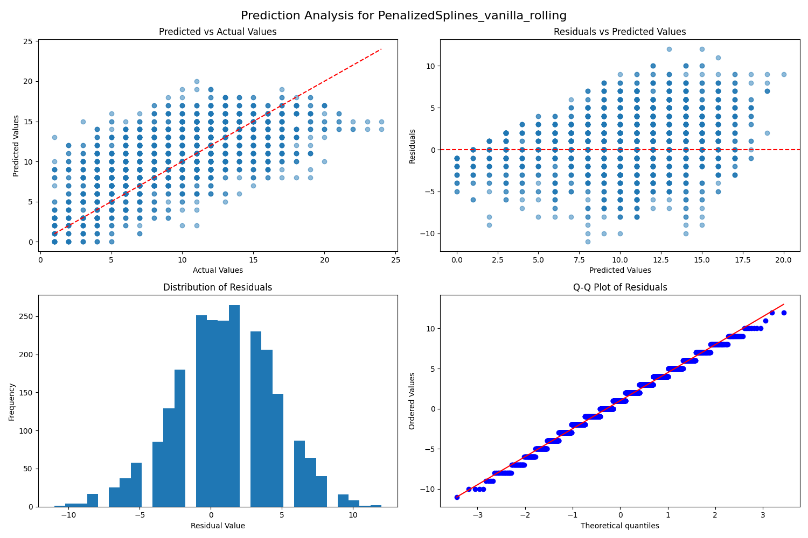

```{r setup, include=FALSE}
knitr::opts_chunk$set(echo = TRUE)
```

***

<div style="text-align: center;">
# **Best Model Configurations**
</div>


### **Duration Prediction**

```{r, echo=FALSE}
library(knitr)

duration_best_model <- data.frame(
  Component = c(
    "Model", "Pipeline","CV Method","RMSE",
    "R^2","Ridge Alpha","Spline Degree","Spline Knots","Scaler"),
  Value = c(
    "Penalized Splines","vanilla","kfold",59.47,0.059,14.38,3,15,"Robust Scaler")
)

kable(duration_best_model)
```

For predicting the 'Duration' target variable, we selected a Penalized Cubic Spline model with 15 knots. Details of the model are summarized in the table above. Notably, this model did not benefit from incorporating interactions between predictors or applying feature compression techniques during pipeline testing. Additionally, a temporal cross-validation approach yielded no significant improvement over the random KFold method. After extensive tuning of the Ridge penalty hyperparameter, the optimal results were achieved with a lambda value of 14.38.

Although this model achieved the lowest RMSE among all tested models, the low $R^2$ indicates it does not effectively explain the overall variance in the response variable.


### **Occupancy Prediction**
```{r, echo=FALSE}
library(knitr)

occupancy_best_model <- data.frame(
  Component = c(
    "Model", "Pipeline","CV Method","RMSE",
    "R^2","Ridge Alpha","Spline Degree","Spline Knots","Scaler"),
  Value = c(
    "Penalized Splines","vanilla","rolling",3.64,0.303,29.76,3,15,"Robust Scaler")
)

kable(occupancy_best_model)

```


For predicting the 'Occupancy' response variable, we again selected a Penalized Cubic Spline model with 15 knots (see the model summary in the table above). However, unlike the 'Duration' model, we observed that the rolling cross-validation method provided better results in this case. Through extensive tuning, the optimal Ridge penalty hyperparameter was determined to be 29.76. While the $R^2$ value of 0.303 is relatively low, it represents a significant improvement compared to the 'Duration' model, accounting for more variability in this target response variable.


***

<div style="text-align: center;">
# **Duration: Best Model Diagnostics**
</div>

Below are diagnostic plots that visually evaluate the performance of the model in predicting the 'Duration' response variable. As noted earlier, the model struggles to explain the variance in the response. These plots compare actual and predicted values and provide insights into the residuals.

In the first scatter plot, the model's predictions are cap-off just under roughly 150, leading to a horizontal cluster of points. This consistent underestimation of larger responses is further reflected in the residual histogram, which has an extended left tail, and the residual QQ plot, where many negative residuals deviate significantly below the normal reference line. Additionally, the residual plot reveals non-constant variance and a distinct pattern, indicating that the model fails to capture the true underlying structure of the data.


```{r, echo=FALSE, fig.align='center', out.width="100%"}
knitr::include_graphics("Duration_PenalizedSplines_vanilla_kfold.jpg")

```


***

<div style="text-align: center;">
# **Occupancy: Best Model Diagnostics**
</div>

To evaluate the performance of our model for part b, we used the same diagnostic visualizations as in part a. In this case, the scatter plots exhibit a distinct grid-like pattern due to the integer nature of both the response variable and the model's predictions. Areas where multiple points share the same value appear as darker shades of blue in the scatter plots.

Consistent with the improved $R^2$ observed for this model, the diagnostic plots reflect a better overall fit compared to part a. Although a slight pattern is still visible in the residual plot, it is evident that this model aligns more closely with the underlying data for this problem.


```{r, echo=FALSE, fig.align='center', out.width="100%"}


```


***

<div style="text-align: center;">
# **Prediction Distributions**
</div>

To further evaluate the predictive performance of our models, we overlaid the distribution of predicted values onto histograms of the actual values. These plots provide a clearer depiction of how well our predictions align with the actual data. In both cases, the models appear to consistently overshoot the bulk of the observations. We suspect this overestimation is driven by the presence of extreme high values in the dataset, which the models struggled to accurately predict.

This challenge likely contributes to the relatively high RMSE for our 'Duration' model. Large errors on these extreme values significantly inflate the RMSE, as it averages the squared differences across all predictions.

```{r, echo=FALSE, fig.align='center', out.width="100%"}
knitr::include_graphics("distribution_comparisons.jpg")

```


#### *WRITE SOMETHING HERE ABOUT IMPUTED VERSION*


```{r, echo=FALSE, fig.align='center', out.width="100%"}
knitr::include_graphics("occupancy_comparison_histogram.jpg")

```


***

<div style="text-align: center;">
# **Results**
</div>


### **Key Findings**

In both cases—predicting 'Duration' and 'Occupancy'—our Penalized Cubic Spline models delivered the best performance. We are especially impressed with the prediction capabilities for the 'Occupancy' model and eager to see how it stacks up against our fellow classmates' models. 


### **Future Directions**

For this project, we were restricted to using only the features provided in the dataset. However, we believe that incorporating external variables could significantly enhance model performance. For example, since the dataset includes timestamps for each check-in and check-out, we could engineer features such as weather conditions at the time of each record. Information about whether it was raining or snowing, for instance, could be a valuable predictor for estimating how many students were likely to visit the Learning Commons.

Additionally, we were limited to working with the models introduced in class. While many of these methods offer some flexibility in handling non-linear relationships, we believe other approaches, such as tree-based models or neural networks, could better capture the non-linear patterns observed in the data. Furthermore, given the apparent dependence of the target variables on temporal factors, exploring time series models could provide an intriguing avenue for improving predictions.
